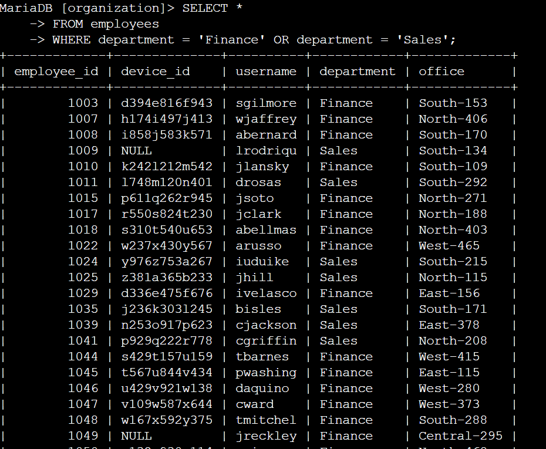
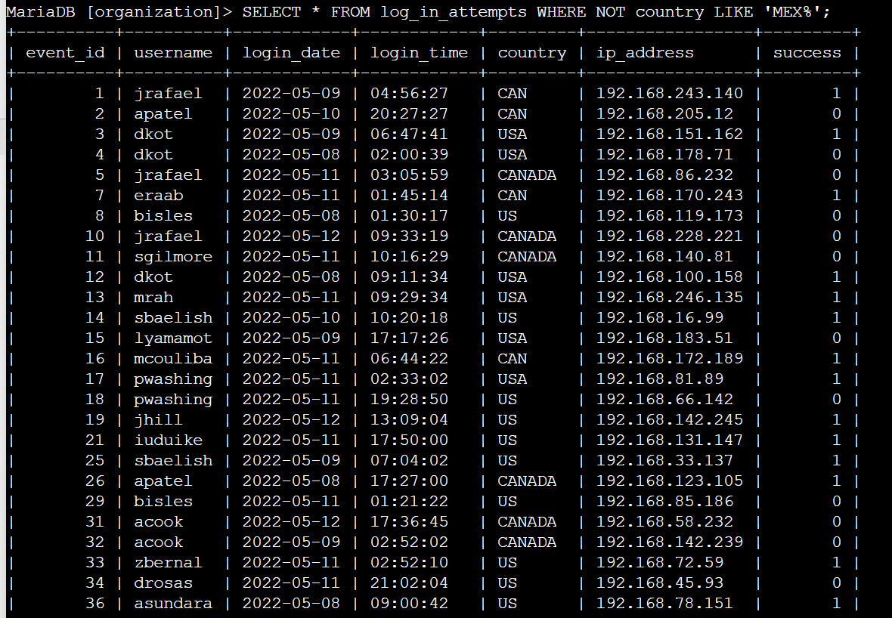
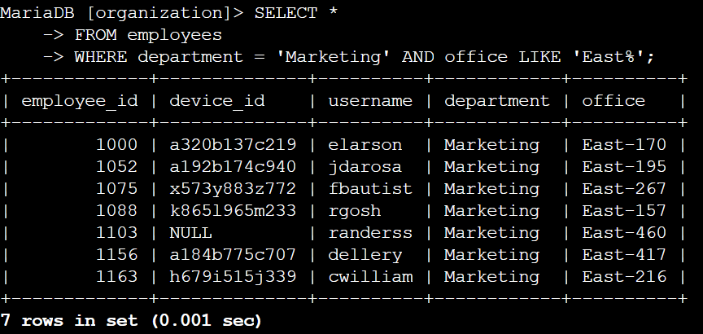
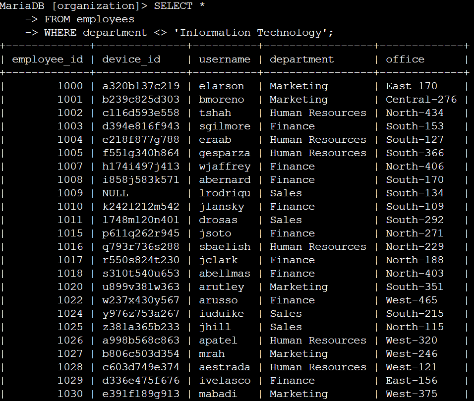
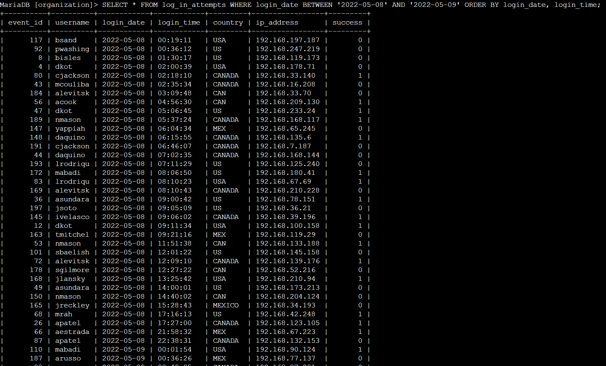
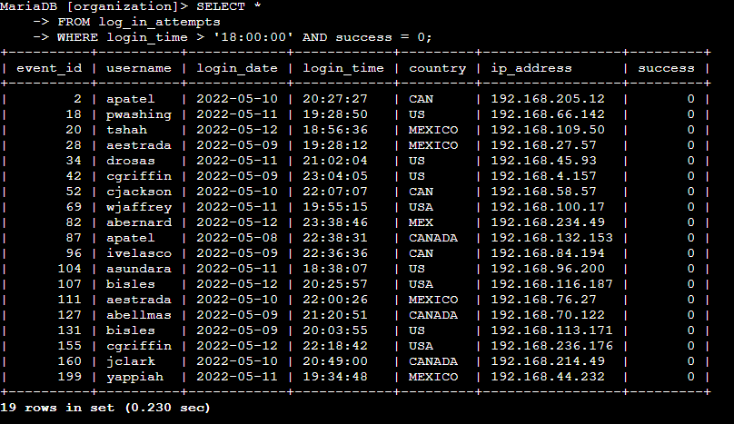

## Project description

This project is for investigating security issues to help keep the system
secure. Based on findings that some potential security issues involve login
attempts and employee machines. We use SQL filters to retrieve records from
different datasets and investigate potential security issues.

## Retrieve after hours failed login attempts

In order to list all after-hours failed logins, which are suspicious in this
case, we performed a SQL query as follows. Since hour regular hour ends at
18:00:00, we set the condition accordingly.

## Retrieve login attempts on specific dates

We also performed a SQL query in order to list all the login attempts happened
on either May 8th or May 9th.

## Retrieve login attempts outside of Mexico

After an investigation, our security team conclude the attack did not originate
in Mexico, we conducted a SQL query to list all login attempts outside of
Mexico. Since our database has variation of stating Mexico, we used a pattern
match that starts with ‘MEX’.

## Retrieve employees in Marketing

We needed a security update specifically for the marketing department who reside
at East buildings. We performed a SQL query to list all employees from the
marketing department and reside to East buildings. Since we have multiple
buildings in East region, we used pattern matching.

## Retrieve employees in Finance or Sales

We needed to perform different security updates on machines for the Sales and
Finance departments, we performed a SQL query to list all employees who work for
either the Sales or Finance department.

## Retrieve all employees not in IT

We needed to perform another security update for other than IT department. We
performed a SQL query in order to list all employees not in IT department.

## Summary

In order to respond to a security incident, we have performed targetted counter
measure. During this report, we successfully conducted multiple SQL queries
which matches the localization of counter measures.

