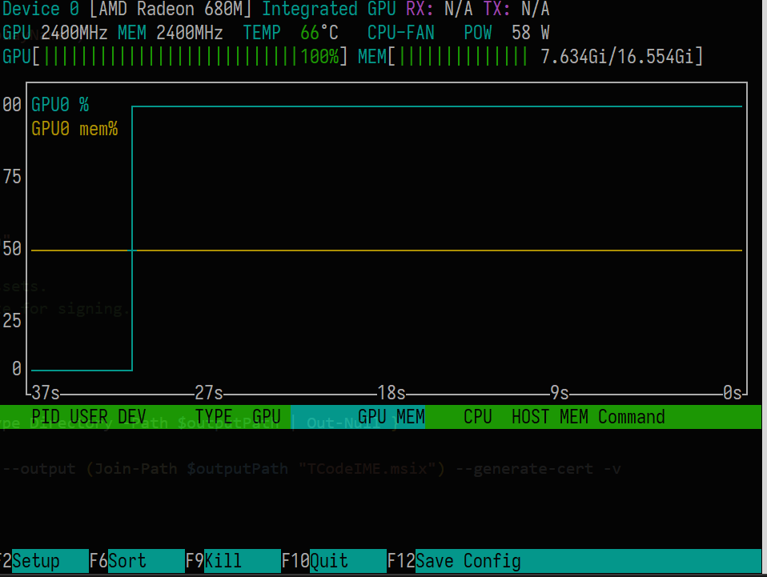

Deploying Large Language Models (LLMs) locally usually requires heavy, expensive
desktop graphics cards. However, if you have an AMD-powered mini PC lying
around—like the Minisforum UM690 featuring a Ryzen 9 6900HX and integrated
Radeon 680M graphics—you can convert it into a quiet, efficient, dedicated AI
server for your local network.

Many developers try to host local models on an entry-level or older gaming
laptop equipped with a dedicated NVIDIA card (like an RTX 3050 or 1650).
However, these laptops are often crippled by a restrictive **4GB VRAM limit**,
which forces the LLM to overflow into system RAM, slowing generation speeds to
an unusable crawl. By contrast, an AMD Mini PC utilizes a Unified Memory
Architecture (UMA). By adjusting a simple BIOS setting, you can allocate **8GB
or more** of your system RAM directly to the integrated Radeon 680M iGPU. This
provides a significantly larger, unified canvas capable of holding modern 3B and
8B models entirely in graphics memory without hitting local VRAM ceilings.

This guide covers how to securely host Ollama on Arch Linux, configure it to run
stable hardware acceleration via Vulkan, apply strict local firewall
restrictions, and seamlessly connect it to your Windows development machine
using the VS Code Continue extension.

---

## The Core Pitfall: ROCm vs. Vulkan on Integrated Graphics

By default, Ollama attempts to use AMD's official ROCm framework for discrete
graphics. On integrated chips (iGPUs) like the Radeon 680M, developers often use
the hardware spoofing trick: `HSA_OVERRIDE_GFX_VERSION=10.3.0`.

**The Problem:** On rolling-release setups like Arch Linux running modern 6.x+
kernels, this spoofing trick can cause unstable kernel panics, CPU soft lockups
(`BUG: soft lockup - CPU stuck`), and complete network drops.

**The Fix:** Disable ROCm spoofing entirely and leverage the stable, native
Vulkan driver ecosystem instead.

---

## Step 1: Securely Configure Ollama on Linux

Instead of letting Ollama listen on all interfaces (`0.0.0.0`), we want our
server to bind exclusively to its assigned local IPv4 address or hostname. This
relies on network segmentation to block the public internet entirely.

Open the systemd configuration file on your Arch host:

```bash
sudo systemctl edit ollama.service
```

Paste the following environment configuration block.

```ini
[Service]
# Clear the default environment variable and startup lines
Environment="OLLAMA_ORIGINS=*"
Environment="OLLAMA_NUM_PARALLEL=1"
Environment="OLLAMA_VULKAN=1"
ExecStart=

# Dynamically grab the first assigned DHCP IPv4 address
ExecStart=/bin/sh -c 'OLLAMA_HOST="$$(hostname -I | awk "{print $$1}"):11434" exec /usr/bin/ollama serve'
```

Save and exit, then grant the `ollama` user the correct hardware rendering
permissions:

```bash
sudo usermod -aG video,render ollama
```

---

## Step 2: Install and Verify Vulkan Drivers

Install the native AMD Vulkan packages and utilities via pacman:

```bash
sudo pacman -S vulkan-radeon vulkan-tools nvtop --needed
```

Reload the service configuration daemon to spin up the changes:

```bash
sudo systemctl daemon-reload
sudo systemctl restart ollama
```

To verify the engine is capturing your iGPU layers correctly, monitor tasks in
real-time by launching the **`nvtop`** process tracker during an active prompt
request. If configured correctly, `ollama ps` will show the model loading onto
the GPU, and your Ryzen CPU utilization will remain perfectly stable.



---

## Step 3: Zero-Trust Isolation with `nftables`

While binding to a local hostname protects you from the outside internet, it
leaves Ollama completely exposed to *any* other device sharing your local Wi-Fi
or LAN subnet. Because Ollama lacks built-in authentication layers, a rogue
device on your network could easily hijack your resources.

To turn this into a true zero-trust setup, deploy `nftables` on your Arch server
to restrict port `11434` strictly to your primary Windows development machine's
IP address (e.g., `192.168.1.50` or hostname):

Open `/etc/nftables.conf` and update your filter table:

```text
table ip filter {
    chain input {
        type filter hook input priority 0; policy accept;

        # Allow only your specific Windows client PC to access Ollama
        ip saddr 192.168.1.50 tcp dport 11434 accept
        tcp dport 11434 drop
    }
}
```

Enable and restart the firewall service:
```bash
sudo systemctl enable --now nftables
sudo systemctl restart nftables
```

---
## Step 4: Connect Your VSCode Client

Newer versions of the VS Code **Continue** extension have shifted away from
standard `.json` formats and require a valid, top-level metadata `config.yaml`
file.

Open your Continue settings panel inside VS Code and replace the contents
entirely with this schema layout to route requests over the local area
network(update your `OLLAMA_HOSTNAME` placeholder):

```yaml
name: Remote Ollama Configuration
version: 1.0.0
schema: v1

models:
  - name: "Qwen 3B (Remote)"
    provider: "ollama"
    model: "qwen2.5:3b"
    apiBase: "http://OLLAMA_HOSTNAME:11434"
    contextLength: 4096
    roles:
      - chat
      - edit

tabAutocompleteModel:
  name: "Qwen Coder 1.5B"
  provider: "ollama"
  model: "qwen2.5-coder:1.5b"
  apiBase: "http://OLLAMA_HOSTNAME:11434"
  roles:
    - autocomplete
```

> 💡 **Architectural Note:** You do **not** need to install Ollama on your local
> development machine. The VSCode Continue extension communicates directly with
> your remote mini-PC using standard network API calls, saving your local
> laptop's battery and RAM entirely!

For integrated memory pools, keeping the autocomplete configuration to a
lightweight 1.5B or 3B model keeps typing execution speeds completely instant
without lagging out your local text cursor.

You can also configure the contextLength based on your shared memory size.

While `qwen2.5:3b` can technically scale up to a 32,768 token memory window,
increasing this value forces the model to allocate significantly more matrix
space in your shared system RAM. For an integrated GPU setup, finding the right
sweet spot is critical to avoid cursor lag in VSCode.


| Context Size | Code Capacity | Shared VRAM | Typing Performance | Best Use Case |
| :--- | :--- | :--- | :--- | :--- |
| **2048** | ~3-4 small files | ~2.1 GB | 🚀 Blazing Fast | Quick snippets & unit tests |
| **4096** *(Default)* | ~8-10 average files | ~2.4 GB | ⚡ Very Snappy | Standard daily coding & chat |
| **8192** | ~20 source files | ~3.1 GB | 🐢 Minor Lag | Multi-file refactoring tasks |
| **16384** | Full API schemas | ~4.4 GB | ⚠️ Higher Latency | Reading massive context / logs |

**Recommendation:** For the best balance of speed and utility on the Minisforum
UM690, stick to **`4096`** for your active autocomplete settings, and only scale
up to **`8192`** or **`16384`** in your main chat window if you are feeding the
AI larger codebase dependencies.


---

## Conclusion

By avoiding ROCm software with fragile hardware spoofing and leveraging native
Vulkan bindings, a Linux mini PC transforms into an incredibly reliable, secure
local inference engine. You keep sensitive code on your private network, free up
your laptop's computing power, and build a powerful homelab copilot instance for
zero subscription costs.

