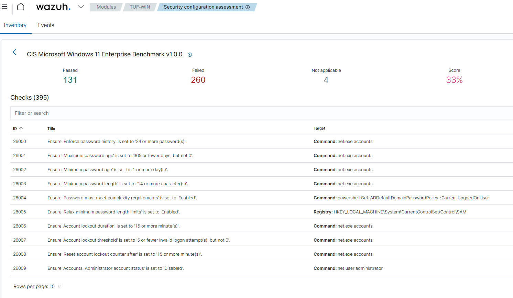
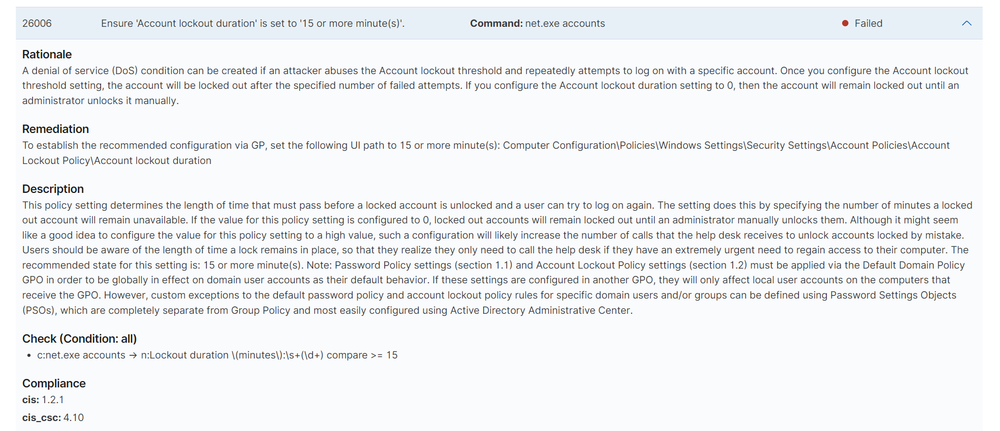
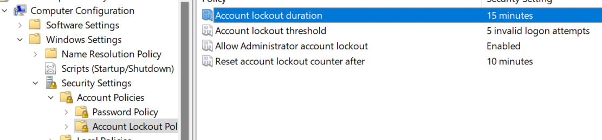

This post is continued from previous entry, [Zero Cost Home Cybersecurity with
WSL2 and Wazuh]().
We have installed Wazuh service on WSL2 and its agent on Windows.
Now we are able to see various suggestions from the scan result.

## Where we are

First, we want to know where we are. NIST Cybersecurity Framework defines
following 5 steps to improve security posture. We want to address each steps
with the activity with Wazuh.

Identify
: We have identified that we want to protect computers with Windows OS in home network.

Protect
: We installed Wazuh agents on each computer.

Detect
: Wazuh agents will detect and send the security events to Wazuh server.

Respond
: Now we want to responds to the collected security events. At the moment, (hopefully) what we see are just weakness of our security control such as Windows policies.

Recover
: Hopefully we are only seeing security events as warning and not any attacks. We don't have any damage to recover.

So let's talk about how to respond to detected weaknesses.

## Respond to weakness of default policies

At glance, we can see a number of Windows policy related weaknesses. In this
setup, I'm using a consumer (gaming) laptop with Windows 11 Home Edition. Now we
want to patch these weakness caused by default (I'm not sure it's default of
Windows, or the manufacturer, ASUS in my case) policies.



Since many of them are caused by Windows Policy, we need to edit them.
Unfortunately, policy editor is not enabled by default with Windows 11 Home
Edition. After a brief research, we can find that we can activate the
functionality with a simple batch file (source: [ WindowsReport-How to Open Group Policy Editor in Windows 11 ](https://windowsreport.com/enable-gpedit-windows-11/) ).

```
@echo off

pushd "%~dp0"

dir /b %SystemRoot%\servicing\Packages\Microsoft-Windows-GroupPolicy-ClientExtensions-Package~3*.mum >List.txt

dir /b %SystemRoot%\servicing\Packages\Microsoft-Windows-GroupPolicy-ClientTools-Package~3*.mum >>List.txt

for /f %%i in ('findstr /i . List.txt 2^>nul') do dism /online /norestart /add-package:"%SystemRoot%\servicing\Packages\%%i"

pause
```

After running the batch file, we can open the Group Policy Editor with
`gpedit.msc`. Now let's patch the policies through an example, ID 26006 "Ensure
'Account lockout duration' is set to '15 or more minute(s)'. Once you clicked
the title, you will see the detail of suggestion, including why CIS is
recommending it and where to patch.



In this case, it is suggested in order to mitigate DoS attack. It makes sense,
right? Also it says where to policy locates. Now we can change the value, from
10 mins to 15 mins.



Boom! We have improved our security posture by updating weak policy.

However, there are some suggestions not making sense in some cases, such as
periodical password update requirements or disable Microsoft account login. In
general, many suggestions are based on enterprise usages while we are facing
home usage. Of cause we have different priorities or balancing on trade-offs.
Which means we don't have to make it 100% compliant.

## Conclusion

We have walked through how to respond to weaknesses detected with Wazuh and how to
patch it. After all, it is not difficult at all. It doesn't require IT knowledge
much, but it can make real differences.
