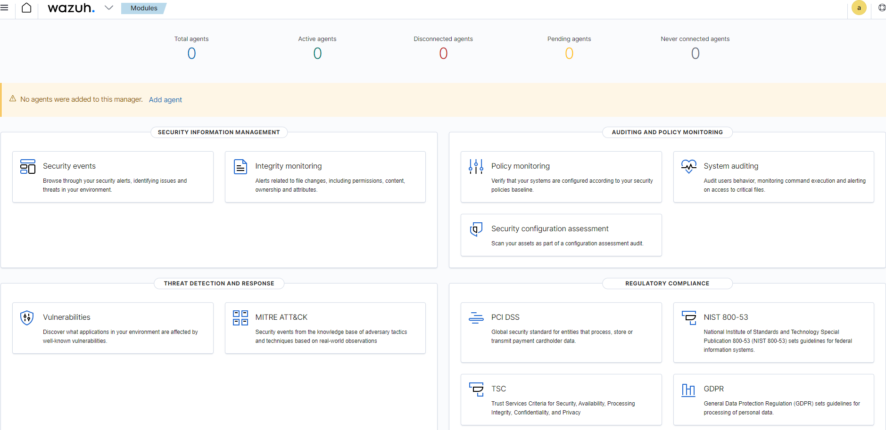
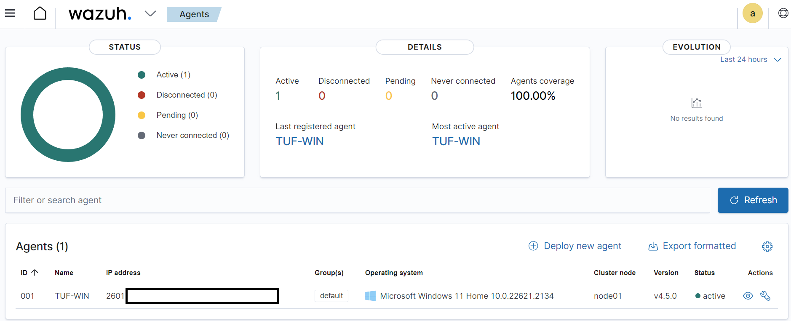
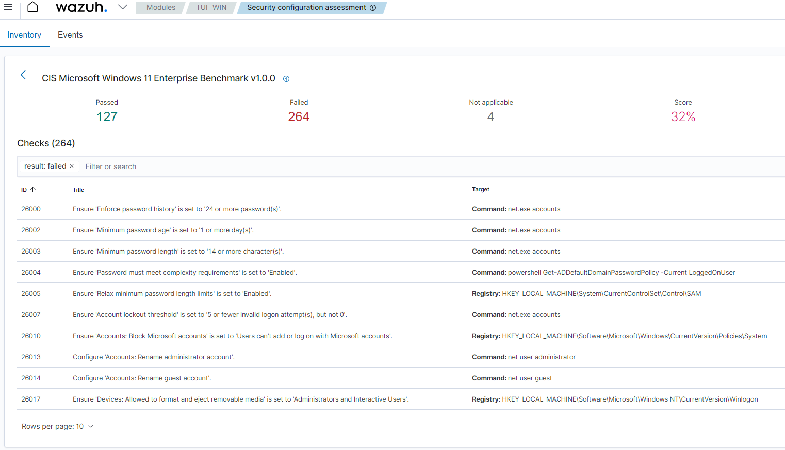

There are many cybersecurity solutions for home usage in combination with
endpoint security and network intrusion detection or prevention systems. Some of
them are software packages such as McAfee and others may be provided by your
ISP, such as Xfinity xFi Advanced Security which comes with ISP-specific
hardware. However, it is unclear to the end users what they do, and sometimes
pricy.

It is also common to network enthusiasts to set up a white-box approach with
plenty of hardware equipment for a home cybersecurity stack. For example, there
are many YouTube videos about how to set up a router to mirror all the traffic
into IDS in a virtual machine, so that all network traffic can be monitored.
However, in my humble opinion, hosting a VM that can monitor all the network
traffic in and out is a very much luxury for most people.

For a home network, many of us are already using Windows Defender Virus
Protection for our computers. For other devices, such as iPhone or Android, we
don’t normally install applications out of the official software store. In other
words, our mobile devices are somewhat protected. The missing parts are, I would
say, endpoint security, cybersecurity intelligence, and SIEM tools. In this
post, I will walk through how to set up them with OSS applications, without
investing in hardware.

[Wazuh](https://wazuh.com/) is a unified XDR(extended detection and response)
and SIEM platform. We can install the service, including server, dashboard, and
indexer, on WSL2 and agent applications on every physical endpoint.

## Server Installation
I assume you already have Ubuntu installed on WSL2 and enabled systemd
(ref. [Systemd Support is Now Available in WSL](https://devblogs.microsoft.com/commandline/systemd-support-is-now-available-in-wsl/) ).
To install Wazuh on WSL2, we can use the official installation script that can
be found at `https://packages.wazuh.com/4.3/wazuh-install.sh`. After the
installation, **dashboard login credentials will be prompted**.

Or, follow the official step-by-step guide ( [Installing the Wazuh server step by step](https://documentation.wazuh.com/current/installation-guide/wazuh-server/step-by-step.html) ).
However, the guide misses the part to run `wazuh-certs-tool.sh` in order to
obtain `wazuh-certificates.tar`.

After the setup, you are now able to access the dashboard via
`https://127.0.0.1`. Use the given credential to login.

## Agent Installation
You can add the agent following the prompt of the dashboard. In our setup, we
should select Windows, Windows 7+, i386/x86_64. Since the server is on WSL2 that
shares the IP address with Windows host, we can specify as `127.0.0.1`.

During agent setup, since both default names of server on WSL2 and agent name of
the hosting Windows are identical, it causes a conflict. I recommend changing
the agent name instead of the machine name. Open a notepad with superuser
privilege for `ossec.conf` written in XML, on the agent installation directory,
and add the `enrollment/agent_name` property in the `client/` path (ref. [Trouble Shooting](https://documentation.wazuh.com/current/user-manual/agent-enrollment/troubleshooting.html#troubleshooting-invalid-agent-name) ).

After restarting the agent, you will see your agent active on the dashboard.

Once you click the agent on the dashboard, you will see a number of potential
issues found with the CIS benchmark, as well as known vulnerabilities from
MITRE.

Now you can add agents to different computers. Please note that WSL2
requires port forwarding configurations on your host of WSL2 (ref. [Accessing a WSL 2 distribution from your local area network(LAN)](https://learn.microsoft.com/en-us/windows/wsl/networking#accessing-a-wsl-2-distribution-from-your-local-area-network-lan) ).

